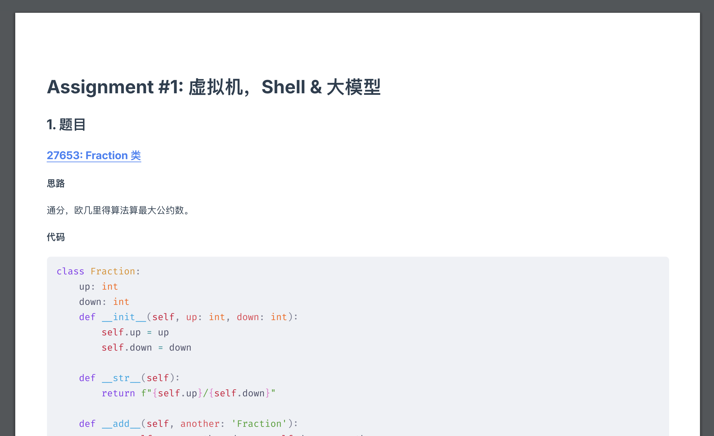

# md2pdf

My tool for rendering markdown files to pdf.

Style centered, instead of performance. Hopes to be pixel-perfect.

Works, although far from perfect.

As a bonus, also supports [Mermaid](https://mermaid.js.org/).

## Quick Start

1. Install [Bun](https://bun.sh)
2. Install dependencies with `bun install`
3. Place markdown file in `{PROJECT ROOT}/md` directory, rename the file to `src.md`

### With Vite, Vue & Puppeteer

4. Run `bun render`
5. You may also check the render result while you write with `bun dev`

### With wkhtmltopdf (experimental, supports PDF outline)

4. Install [wkhtmltopdf](https://wkhtmltopdf.org/) and add it to PATH
5. Install [Fira Code](https://github.com/tonsky/FiraCode) (not "Fira Code VF") and [Inter](https://rsms.me/inter) (not InterVariable) locally on your machine
6. Run `bun wkrender`

## Project Structure

- `src/assets` stores the CSS files used during rendering
- `vite-plugin/markdown.ts` configures MarkdownIt with plugins.
- `vite-plugin/generator.ts` renders Markdown file to Vue component.

## How It Works

We use MarkdownIt to render Markdown files into HTML, and by wrapping
it inside the `template` tag (and processing the `pre` tag with `v-pre`
to avoid the `{{expressions}}` in Mermaid), makes it a Vue component.

Why a Vue component instead of just using raw HTML? Actually the Vue
plugin for Vite does tons of work behind the scenes like importing
assets etc, which makes it possible to reference relative assets, like
images, outside the `public` directory without much tweaking.

When you run `bun render`, we creates a Vite DevServer, launches a
Puppeteer instance (in headless mode), navigates to the page URL, and
captures the full page as PDF.

## Limitations

### With Vite, Vue & Puppeteer

- PDF captures by Puppeteer (or saved with Chrome) does not generate
  ocument outline.

### With wkhtmltopdf

- Rendered PDF may not be in line with `bun dev`, as wkhtmltopdf runs
  on very old WebKit Engine.
- Mermaid is currently not support because of the same problem mentioned
  above.
- Page break cannot be created in codeblocks, so codeblocks will create
  a new page if available space is not enough, resulting in large empty
  spaces if codeblocks are huge.

## Acknowledgements

- [The Inter typeface family](https://rsms.me/inter) is licensed under the SIL Open Font License, Copyright (c) 2016 The Inter Project Authors
- [Fira Code](https://github.com/tonsky/FiraCode) is licensed under the SIL Open Font License, Copyright (c) 2014, The Fira Code Project Authors
